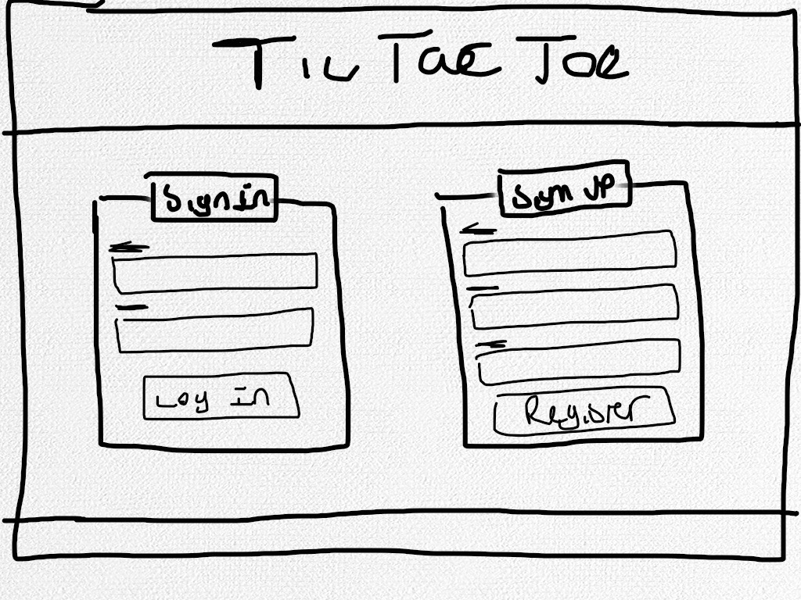
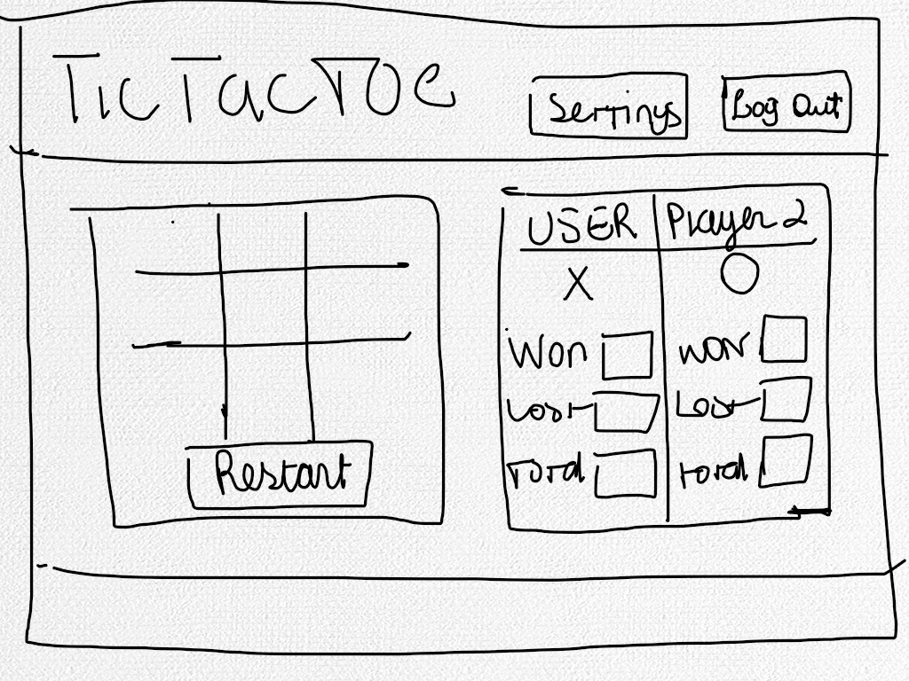

# TicTacToe

## Objective:

To create a functional Tic Tac Toe game which allows the user to store their personal and game information to track how many games were played. This game is to be built individually.

## Requirements to Follow:

This game must be stored in a public GitHub account, changes made are to be commited and deploy. Deploy often to keep the records up to date. This game must be original, and functional.
Keep this game within a single page application. Do not create multiple pages for this website functions, no browser refreshing is allowed.
This game should also allow multiple games, one at a time by using a restart function/button, visually display the winner and allow the switch between player X and player O.

## Technology Used:

This project is written in the following languages:
HTML5
Bootstrap
CSS3
SCSS
JavaScript (ES6)
jQuery
AJAX
Git/GitHub

## Planning and Development Process:

User stories were created to propose the features of this game that would be used by an user who is to sing up and sign in to play the game:

1.As a user I would like to have an easy interface.
2.As a user I would like to be able to sign in.
3.As a user I would like to be able to sign out.
4.As a user I would like to be able to sign up.
5.As a user I would like to keep a record or my scores.
6.As a user I would like to be able to change my password
7.As a user I would like to start or restart the game.
8.As a user I would like to be notified of errors.
9.As a user I would like to be notified if I win or lose.

The original User Stories was followed by the project's Wireframe (attached below) which helped in visualizing a possible end product.
1. View 1: Fist Wireframe, front page, should contain:
Title/Header/Main page name
Initial Nav Bar
Sign Up form
Log In form
Footer with additional information

  1. SignUp Form visible on first page
  Label
  Name, username, email, password, password confirmation
  Submit button (event).

  2. SignIn Form visible on first page
  Label
  Username & password
  Submit button (event).

2. View 2: Second Wireframe, "second" page, members page, should contain:
Title/Header/Main page name
Welcome message
Initial Nav Bar
Secondary navbar with: New Game, Game ID, Number of Games, Settings and Log Out buttons
About me (game)
Instructions to start the game
Greeting message
Footer with additional information

  1. Welcome Message: Located on navbar, to fade out at log out
  2. New game button: start a new game, refreshes board and hides Instructions
  3. Game ID button: retrieves the ID of the current game, hides About Me
  4. Number of Games button: Displays the total number of games played by the current user.
  5. Settings button: Shows Change Password form.
  6. Log Out: Signs user out, Log out message displayed on navbar

3. View 3: Aditional Wireframe, not previously planned. "Third" page, members page, should contain:
Title/Header/Main page name
Welcome message
Initial Nav Bar
Secondary navbar with: New Game, Game ID, Number of Games, Settings and Log Out buttons
About me (game)
Instructions to start the game / Game board / Winner
Greeting message / Players Turn
Footer with additional information

  1. Game Board: activated when New Game button is clicked, game checks for a winner, if condition is met the game board hides and the winner message shows instead. New game button must be clicked again to start a new game.
  2. Once the game starts greeting message will change to Player's turn.
  3. All other buttons are still functional

## General Notes:

// toolbar to be achieved in HTML with boostrap

// settings and logout on nav bar to pop up after user logs in

// hide if user logs out

// settings "redirects" to change password and nickname

// settings and logout buttons to be added on HTML and styled on CSS

// initial view will have two boxes, to be added with boostrap

// box on the left will have the log in inputs

// box on the right will have the sign up inputs

// notification letting user know if they signed up successfully (or not)

// notification letting user know they have logged in successfully (or not)

// display "Welcome + user" once user logs in

// direct user to log in after sign up

// after user signs in, box on the left will become tic tac toe game board

// box on the right will keep track of both player's scores

// list games won, games lost, total games

// attempt button or boostrap for tic tac toe board

// game logic record user 1 as X or O

// possible default

// attempt to make it an option

// record user 2 as the other option

//  attempt to add user 3 as computer for "offline" game (game with computer)

// list 9 boxes on an array

// possible if statement for computer gam

## Schedule Followed:

Set Up
1.	 Download Browser Template
2.	 Create a Github Repository
3.	 Deploy to Github Pages
Game UI Round 1
1.	 Design a simple game board
2.	 Add a click handler for when a space on the game board is clicked
3.	 If the user clicks on a valid space then add their X or O
4.	 Do not allow users to add an X or O to an invalid space
Game Engine
1.	 Create Empty Board in JS
2.	 Create a way to keep track of the current player
3.	 Add current player to your JavaScript representation of the board
o	 Current player rotates between X and O
o	 Can not choose already occupied spots
4.	 Check Board for Winner
Game UI Round 2
1.	 Update the game engine when the game board is updated
2.	 Add messaging for the user when the turn changes
3.	 Add messaging for the user when the user clicks on an invalid space
4.	 Add messaging for the user when the game is over (win or draw)
5.	 Do not allow users to add an X or O to any spaces after the game is over
Authentication
1.	 Review api-token-auth
2.	 Sign Up (curl then web app)
3.	 Sign In (curl then web app)
4.	 Change Password (curl then web app)
5.	 Sign Out (curl then web page)
6.	 All API calls have success or failure messages
Game API
1.	 Review jquery-ajax-crud
2.	 Create Game, start new game (curl then web app)
3.	 Update Game, play the game (curl then web app)
4.	 Get Games (curl then web app)
Final Touches
1.	 README
2.	 Troubleshoot/Debug
3.	 Style
Technical Specifications
1.	 Use a custom game engine written by you.
2.	 Be a single-page application, no browser refresh.
3.	 Render a game board in the browser.
4.	 Switch turns between X and O (or whichever markers you select). Tip: Assume player X is the first player to start the game.
5.	 Visually display which side won if a player gets three in a row or show a draw if neither wins.
6.	 Support playing multiple games, one at a time.
7.	 Use jQuery for DOM manipulation and event handling.
8.	 Use AJAX for interacting with a provided API.
API Specifications
1.	 Create new games on the server. (CREATE)
2.	 Update a game by storing new moves. (UPDATE)
3.	 Visually display the results of retrieving game statistics, such as total games won by a user. (READ)
4.	 Give feedback to the user after each action.
Auth Specifications
1.	 Signup with email, password, and password confirmation.
2.	 Login with email and password.
3.	 Logout when logged in.
4.	 Change password with current and new password.
5.	 Signup and Signin must only be available to not signed in users.
6.	 Logout and Change password must only be available to signed in users.
7.	 Give feedback to the user after each action's success or failure.
8.	 All forms must clear after submit success or failure
DO NOT!!
Your app must not:
1.	 Delete your repository at any time or start over.
2.	 Rely on refreshing the page for any functionality.
3.	 Have any user-facing bugs.
o	 Display non-functional buttons, nor buttons that do not successfully complete a task.
o	 Show actions at inappropriate times (example: sign out button when not signed in).
o	 Forms not clearing at appropriate times (example: sign up form not clearing after success).
4.	 Allow the same game to be played after a player has won or tied.
5.	 Allow players to move in the same square more than once.
6.	 Change players when an invalid move is made.
7.	 Use alerts for anything.
8.	 Display errors or warnings in the console.
9.	 Display debugging messages in the console.

## Problem Solving:

1. console.log what is not working
2. check devs tools online for error messages
3. make sure all functions were exported
4. explain the error to someone else
5. put the error in words and undertand the error
6. make sure to know which function or part of the code is responsible or giving the error
7. look at previous commits
8. if a function, is it returning something, is it passing something?
9. unable to fix open an issue in the issue channel.

## Unsolved Problems / goals

Problems: Game is pluggin player O into game array first while the board plugs X. I am able to obtain the correct winner thanks to an if statement that plugs the oposite player as the winner.

Goals:
1. Add a multiplayer function.
2. Retrieve the total amount of games won by X vs O
3. Pause and restart game with timer
4. Retrieve unfinished game
5. Retrieve previously played games
6. Reactivate the current game ID count commented out

[Tic-tac-toe Wireframe 1](./TicTacToePg1.jpeg) 
[Tic-tac-toe Wireframe 2](./TicTacToen2.jpeg) 
